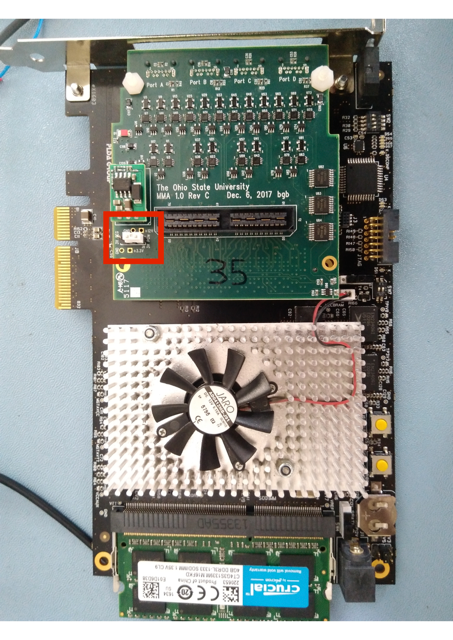

# Firmware Guide

How to pick your firmware organized by Front-End type, then adapter card.
For the XpressK7 there will always be two version (black), one -**160** and one -**325** version for the different FPGA types. New version of the card (green) is -**trenz**.

## RD53A

### Multi-Module Adapter

- ``bram_rd53a_quad_ohio-XXX/rd53a_quad_ohio_160Mbps.bit`` => Single RD53A channel enabled on Port A
- ``bram_rd53a_quad_ohio-XXX/rd53a_quad_ohio_160Mbps_4chip.bit`` => To enable all four channels.
- ``bram_rd53a_quad_ohio-XXX/rd53a_quad_ohio_160Mbps_2chip2trig.bit`` => To enable two channels for chip readout and two channels for HitOr (to be added).
- In order to power correctly the adapter card, a jumper needs to be added to **3V PCI** pin, as shown on picture below.

When the board is powered correctly, a red LED should light up. More information about the adapter card can be found [Multi Chip Adapter Card](https://twiki.cern.ch/twiki/bin/viewauth/RD53/RD53ATesting#Multi_Chip_FMC).

On a SCC [Single Chip Card](https://twiki.cern.ch/twiki/bin/viewauth/RD53/RD53ATesting#RD53A_Single_Chip_Card_SCC) the CMD line is already AC coupled. On the Ohio card there is additional AC coupleing as shown on the picture.

To avoid double AC coupleing on the CMD line, one should replace the capasitors with jumpers and remove the termination, as shown on the picture.

In order to read the HitOrs from Port B and Port D, one has to modify the AC copleing of the Data lines on the Ohio card:

The capasitors should be replaced with jummpers as shown on the picture:

